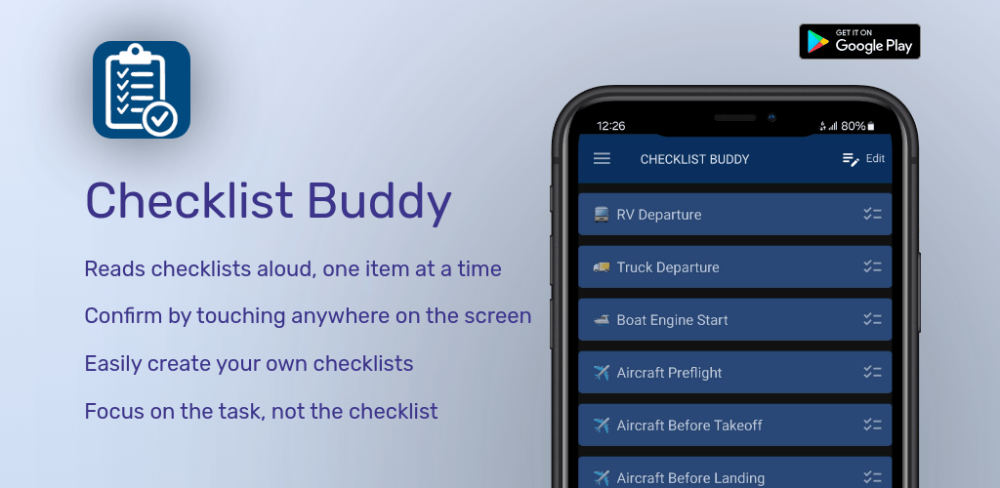

**Update: Checklist Buddy is now free, no strings attached. Enjoy!**

Checklist Buddy reads items on a checklist aloud, one at a time.

Checklist Buddy is a traditional to-do list with unique features. 
Inspiration comes from my time as an airplane pilot, where one pilot 
read the checklist aloud, and the other pilot performed the task.

The interface is optimized so a checklist can be conducted by holding 
the phone/tablet in one hand without looking at the screen. Touching 
anywhere on the screen transitions to the next checklist item.

Checklist Buddy encourages focusing on the task, not the checklist.

Use it in aircraft, motor homes, boats, or anywhere you need a series
of steps read back in sequence.

